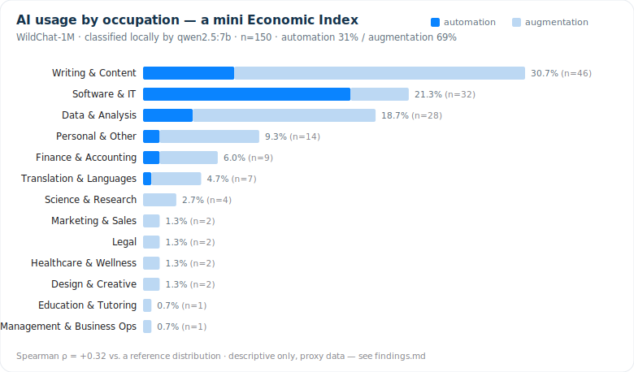

<div align="center">



# 🧩 Agentic Data Platform

**An LLM agent that ingests, integrates, validates and serves heterogeneous data —
with task decomposition, tool calling, memory, retry/self-repair, evaluation and monitoring.**

*Built around seven production concerns, with a mini [Anthropic Economic Index](#-economic-index-module) replica on top.*

<br/>


</div>

---

A single LLM agent turns raw, messy, multi-source data into **clean, reusable, well-governed
datasets** and serves them over an API — the way a data-platform team works, in miniature. It is
deliberately engineered around the concerns that separate a real platform from a notebook:
**task decomposition, tool calling, persistent memory, failure retry & self-repair, evaluation,
monitoring, and stability.**

It runs **fully offline with zero cost** (deterministic planner + local classifiers), and scales
up to a real LLM (local **Ollama** on your GPU, or the **Claude API**) and a real cloud warehouse
(**MotherDuck**, or **BigQuery** via dbt) by flipping a config flag — no code changes.

## ✨ Highlights

- 🤖 **One agent, real engineering** — a centralized `plan → execute → observe` loop calls typed tools with retry, SQL self-repair, and a circuit breaker.
- 🧬 **End-to-end lineage** — every served number traces back through aggregation → transform → raw source, blending ingest lineage with dbt's manifest DAG.
- 🧱 **Versioned, tested, portable transforms** — business logic lives in **dbt** models (with tests), not Python strings, so it runs unchanged on DuckDB / MotherDuck / BigQuery.
- 📊 **A mini Anthropic Economic Index** — classifies real human-LLM conversations into O*NET occupations and **automation-vs-augmentation**, then validates the distribution against a reference.
- 🌱 **Graceful degradation** — no API key? It falls back to a deterministic planner and heuristic classifier so every demo, test and eval still passes.

## 🏗️ Architecture

<div align="center">

</div>

## 🤖 The seven production concerns

| # | Concern | Where it lives |
|---|---|---|
| 1 | **Task decomposition** | [`planner.py`](adp/planner.py) — LLM or deterministic plan |
| 2 | **Tool calling** | [`agent.py`](adp/agent.py) · [`tools.py`](adp/tools.py) — one loop, typed tools |
| 3 | **Memory** | [`memory.py`](adp/memory.py) — catalog · run history · lineage |
| 4 | **Retry / self-repair** | [`retry.py`](adp/retry.py) — backoff, circuit breaker, LLM SQL repair |
| 5 | **Evaluation** | [`eval/`](eval/) · [`eval_harness.py`](adp/eval_harness.py) — task suite, gates CI |
| 6 | **Monitoring** | [`monitoring.py`](adp/monitoring.py) — structured logs + p50/p95 metrics |
| 7 | **Stability** | SELECT-only SQL guard · idempotent writes · graceful fallbacks · timeouts |

## 📊 Economic Index module

[`adp/econ/`](adp/econ/) is a small, faithful replica of the **Anthropic Economic Index**
methodology, built on the platform:

```
conversations → classify (occupation + automation/augmentation)
             → aggregate to occupation shares → validate vs a reference (Spearman)
             → registered in the catalog → served at GET /datasets/econ_index
```

The classifier is **pluggable**, so you choose the cost/quality trade-off:

| Backend | Cost | Notes |
|---|---|---|
| `heuristic` | free | keyword match; default, used by tests/CI and the offline demo |
| `ollama` | free | a local LLM on your GPU (e.g. `qwen2.5:7b`) |
| `claude` | paid | the Anthropic API — highest quality |

> **Verified run:** 150 real conversations from **WildChat-1M**, classified locally with
> `qwen2.5:7b` (0 fallbacks), produced a usage distribution led by **writing, software and data
> analysis** — matching the published Economic Index shape.

<div align="center">

</div>

📄 **Full write-up** — method, validation (Spearman ρ), and honest limitations: **[docs/findings.md](docs/findings.md)**.
Scaling to the full corpus + O*NET taxonomy: [`adp/econ/README.md`](adp/econ/README.md).

## 🧱 Transforms: dbt + portable warehouses

The same `dbt build` runs against any target — switch with one env var:

| Target | Backend | How |
|---|---|---|
| `dev` | local **DuckDB** file | default; verified in CI |
| `cloud` | **MotherDuck** (serverless, DuckDB-compatible) | `ADP_WAREHOUSE_BACKEND=motherduck` + `MOTHERDUCK_TOKEN` |
| `gcp` | **Google BigQuery** | `pip install ".[gcp]"` + GCP creds, `--target gcp` |

## 🚀 Quickstart

```bash
git clone https://github.com/790504/agentic-data-platform && cd agentic-data-platform
uv venv && uv pip install -e ".[dev]"

uv run adp demo      # ingest 3 sources → build a county-quarter panel → validate
uv run adp dbt       # ingest → orchestrate dbt build + tests → manifest lineage
uv run adp econ      # classify conversations → AI economic index → validate (free, offline)
uv run adp eval      # evaluation suite (non-zero exit on failure)
uv run adp serve     # FastAPI on http://127.0.0.1:8000  (docs at /docs)
uv run pytest        # 18 unit + dbt integration tests
```

<details>
<summary>Use a local LLM or a cloud warehouse</summary>

```bash
# classify with a local model on your GPU (free):
ADP_ECON_CLASSIFIER=ollama uv run adp econ --source wildchat --n 500

# run the whole platform on a cloud warehouse (free MotherDuck token):
export ADP_WAREHOUSE_BACKEND=motherduck MOTHERDUCK_TOKEN=...
uv run adp dbt
```
</details>

## 🗂️ Repository structure

```
agentic-data-platform/
├── adp/                    # the platform package
│   ├── agent.py            # plan → execute → observe loop (retry + SQL self-repair)
│   ├── planner.py          # LLM or deterministic task decomposition
│   ├── tools.py            # typed tool registry (ingest · run_dbt · build_panel · run_sql · validate)
│   ├── warehouse.py        # DuckDB / MotherDuck connection + layers (raw·staging·marts·meta)
│   ├── memory.py           # catalog · run history · lineage
│   ├── dbt_runner.py       # orchestrates dbt; lineage from the manifest DAG
│   ├── llm.py              # Anthropic client (graceful offline fallback)
│   ├── retry.py            # backoff + circuit breaker
│   ├── monitoring.py       # structured logs + p50/p95 metrics
│   ├── api.py              # FastAPI: serve data / lineage / metrics
│   └── econ/               # mini Anthropic-Economic-Index module
│       ├── classify.py     # heuristic / ollama / claude backends
│       ├── taxonomy.py     # O*NET-style occupation taxonomy
│       ├── wildchat.py     # WildChat-1M loader
│       └── pipeline.py     # classify → aggregate → validate
├── transform/              # dbt project (staging + marts + tests)
├── eval/                   # evaluation suite
├── tests/                  # 18 unit + dbt integration tests
└── docs/                   # architecture diagram + hero
```

## 🧰 Tech stack

`Python` · `DuckDB` · `MotherDuck` · `dbt` · `FastAPI` · `pandas` · `Anthropic` / `Ollama` · `Docker` · `GitHub Actions`

## 🗺️ Roadmap

- [x] Versioned, tested dbt transforms, orchestrated by the agent
- [x] Cloud warehouse behind one connection string (MotherDuck; BigQuery-portable)
- [x] Lineage from dbt's manifest DAG, merged with ingest lineage
- [x] Economic Index module (classify usage → occupation shares → validate)
- [ ] OpenTelemetry tracing
- [ ] Per-stage checkpointing for crash-resume on long ingests
- [ ] Privacy-preserving aggregation (k-anonymity / differential privacy) on served datasets

## 📄 License

[MIT](LICENSE)
